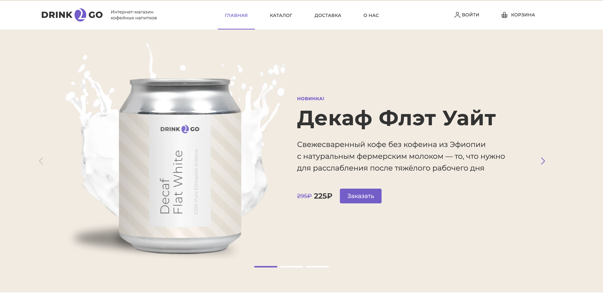

Проект Drink2GO для HTML Academy

В рамках проекта была реализована адаптивная вёрстка главной страницы сайта с использованием методологии БЭМ и препроцессора SCSS. Основной акцент был сделан на соответствие макету (PixelPerfect) и корректное отображение на всех устройствах: мобильных (320px — 767px), планшетных (768px — 1439px) и десктопных (от 1440px).

Ключевые особенности проекта:

Адаптивность и фиксированная ширина контейнера: Вёрстка выполнена с использованием подхода mobile-first. Контейнер фиксированной ширины центрирован, а фоны и карта растягиваются на всю ширину вьюпорта.

Интерактивные компоненты: Реализованы мобильное меню, слайдеры (без использования библиотек), кастомные чекбоксы, радиокнопки и рейндж-слайдер для выбора цены (с использованием библиотеки no-ui-slider). 

Форма с валидацией: В блоке сортировки и фильтров реализована форма с кастомными элементами управления.

Ретинизация и адаптивность изображений: Логотип, изображения в слайдере и карта адаптированы под разные устройства и ретинизированы для экранов с высокой плотностью пикселей.

Переполнение контентом: Учтены возможные изменения в количестве элементов (меню, слайды, карточки каталога, пункты преимуществ, ссылки в подвале).

Технические детали:

Использовалась предоставленная сборка Gulp без модификаций.

Для стилизации контентных элементов применялся каскад, без добавления лишних классов.

В проекте использовался векторный спрайт для иконок (шапка, преимущества, кнопки, подвал).

Все интерактивные элементы (меню, слайдеры, форма) соответствуют требованиям заказчика.

Результат:
Проект демонстрирует навыки работы с современными инструментами вёрстки, внимание к деталям и умение реализовывать сложные интерактивные компоненты с учётом требований адаптивности и кроссбраузерности.

Особенности реализации:

Мобильное меню отображается поверх страницы и переключается тапом.

Форма сортировки и фильтров стилизована с использованием кастомных чекбоксов и радиокнопок.

Рейндж-слайдер для выбора цены привязан к значениям полей.

Ссылка на страницу [тут](https://dxenium.github.io/drink2go-check/)

